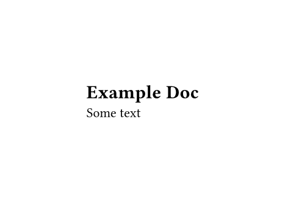

<!-- README.md is generated from README.Rmd. Please edit that file -->

```{r, include = FALSE}
knitr::opts_chunk$set(
  collapse = TRUE,
  comment = '#>',
  fig.path = 'man/figures/README-',
  out.width = '100%'
)
```

# typr 

<!-- badges: start -->
[](https://github.com/christopherkenny/typr/actions/workflows/R-CMD-check.yaml)
<!-- badges: end -->

The goal of `typr` is to render Typst documents from R.
By default, it will try to use the Typst CLI.
If the Typst CLI is not installed, it will try to use Quarto, which bundles Typst.

## Installation

You can install the development version of `typr` from [GitHub](https://github.com/christopherkenny/typr) with:

``` r
# install.packages('pak')
pak::pak('christopherkenny/typr')
```

## Example

The following example shows how to use `typr` to render a Typst document.
It can take a path to a file or lines to use.
Below, I pass lines to compile:

```{r example}
library(typr)

doc <- c(
  '#set page(height: auto, width: auto)',
  '= Example Doc',
  'Some text'
)

typr_compile(doc, output_format = 'png')
```


